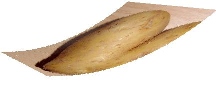



## Transform picture using StretchBlt

### Description

This code show you how to transform the picture using StretchBlt
 
### More Info
 

             |
---                |---
**Submitted On**   |2009-07-09 11:50:02
**By**             |[Saed abumokh](https://github.com/Planet-Source-Code/PSCIndex/blob/master/ByAuthor/saed-abumokh.md)
**Level**          |Intermediate
**User Rating**    |4.8 (38 globes from 8 users)
**Compatibility**  |VB 6\.0
**Category**       |[Graphics](https://github.com/Planet-Source-Code/PSCIndex/blob/master/ByCategory/graphics__1-46.md)
**World**          |[Visual Basic](https://github.com/Planet-Source-Code/PSCIndex/blob/master/ByWorld/visual-basic.md)
**Archive File**   |[Transform\_215714792009\.zip](https://github.com/Planet-Source-Code/saed-abumokh-transform-picture-using-stretchblt__1-72261/archive/master.zip)

